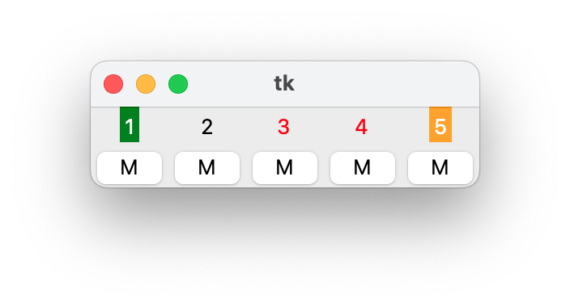

# Family Radio Service (FRS) Station

This is the code from a project for CSE 490 W at the University of Washington, taught by Professor Joshua Smith in Spring of 2022.

It is based on the code from [Kavel Rao ](https://github.com/kavelrao/fm-streaming).

# Set Up

See `requirements.txt` for the required python packages. You might also need to install `librtlsdr` in addition to the pyton packages.

# Usage

If you have an SDR that is compatible with the python `rtlsdr` library, you can run `fm_radio.py` to monitor FRS channels. You can set the configuration in `config.py`.

Above is a screenshot of the UI. Each channel has 4 possible states:

* Active: the audio is playing in the speaker. (Shown as green background)
* Waiting: the audio is delayed to avoid overlapping with the active channel. The sound will play back later. (Shown as yellow background)
* Nothing: there’s no audio detected on this channel. (Shown as no background)
* Muted: the voice on this channel should be ignored. (Shown as red foreground)

Click the button below each channel to mute or un-mute a channel.

More details on the project can be found in my writeup [here](final_report.pdf).
